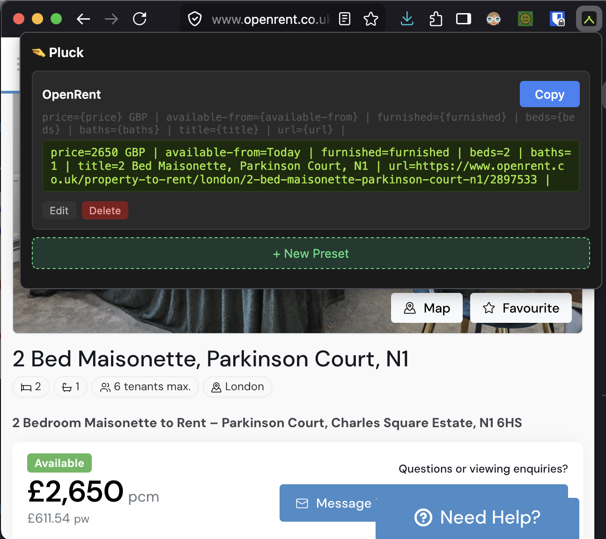
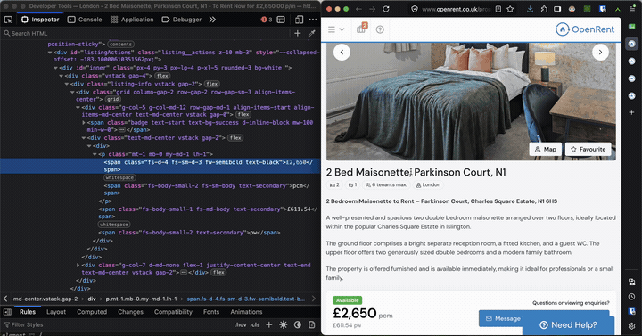
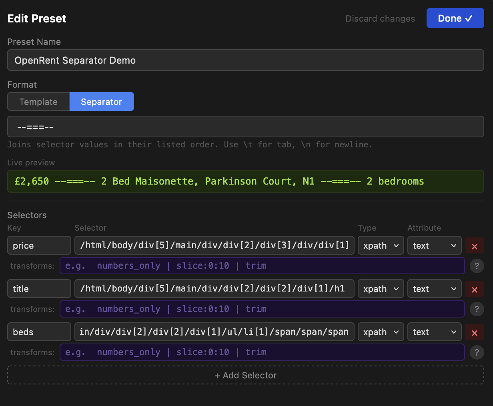

# Pluck

A Firefox extension for plucking values off a page with custom selectors and copying them, formatted, to the clipboard.

You can use this to quickly gather information from various webpages. Less hassle than an automatic web scraper, faster than manually copy-pasting data from different web pages.

Define a **preset** = a list of selectors (CSS / XPath / `meta` / `page`) + a format template. Click the toolbar icon, see a live preview of the formatted output for the current tab, hit copy.

## Features

- **Custom selectors** — pick values via CSS, XPath, `<meta>` tags, or `window.location` fields.
- **Live preview in the popup** — see the formatted output for the current tab before you copy.
- **Two formatting modes** — free-form `{key}` template, or join-by-separator (TSV, CSV, newlines, anything).
- **Per-selector transforms** — chainable pipeline: `trim`, `numbers_only`, `regex_extract`, `slice`, `replace`, `prepend`/`append`, and more.
- **Multiple presets** — keep one per site or per workflow.
- **No network, no telemetry, no background script** — everything runs in the popup; presets live in `browser.storage.local`.

## Setup

1. Open `about:debugging#/runtime/this-firefox` in Firefox.
2. Click **Load Temporary Add-on…** and pick `manifest.json` from this directory.
3. Click the Pluck icon in the toolbar to open the popup.

Temporary add-ons are removed when Firefox restarts. For permanent install, sign through addons.mozilla.org.

## Usage

The popup shows each preset with a live preview of what it would copy. Click **Copy to Clipboard** to write it to the clipboard. Use **Edit** / **+ New Preset** to manage presets.

### Selector types

| Type    | Selector field                                     | Notes                                              |
| ------- | -------------------------------------------------- | -------------------------------------------------- |
| `css`   | Any CSS selector                                   | First match (`document.querySelector`)             |
| `xpath` | XPath expression                                   | First match (`XPathResult.FIRST_ORDERED_NODE_TYPE`) |
| `meta`  | `property` or `name` of a `<meta>` tag             | Reads the `content` attribute                      |
| `page`  | One of `url`, `title`, `host`, `path`, `origin`, `protocol` | Reads from `window.location` / `document` |

### Attribute (for `css` / `xpath`)

`text` (default), `html`, `href`, `src`, `value`, `content`, or any other attribute name.

### Transforms

A pipe-separated chain applied left-to-right after extraction:

| Transform              | Effect                                         |
| ---------------------- | ---------------------------------------------- |
| `trim`                 | Strip leading/trailing whitespace              |
| `uppercase`            | `value.toUpperCase()`                          |
| `lowercase`            | `value.toLowerCase()`                          |
| `numbers_only`         | Keep `0-9 . -` only                            |
| `letters_only`         | Keep `a-z A-Z` only                            |
| `slice:start:end`      | `value.slice(start, end)`                      |
| `replace:from:to`      | Replace all occurrences (literal, not regex)   |
| `regex_remove:pattern` | `.replace(new RegExp(pattern, 'g'), '')`       |
| `regex_extract:pattern`| First capture group, or full match if no group |
| `prepend:text`         | Add `text` before the value                    |
| `append:text`          | Add `text` after the value                     |
| `split:sep:idx`        | `value.split(sep)[idx]`                        |

**Quirk:** `replace:from:to` parses the first `:` as the separator, so `from` cannot contain `:`. Use `regex_remove` or `regex_extract` if you need that.

### Format mode

Each preset uses one of two formatting modes, picked by the tab toggle in the edit view:

**Template** (default) — use `{key}` placeholders for each selector. Example: `£{price} — {url}` → `£450000 — https://example.com/listing/123`.

**Separator** — join all selector values in their listed order with a given string. Useful for TSV (`\t`), CSV (`,`), or newline-separated output. Selector order in the edit view is the join order.

In both modes, literal `\t` and `\n` in the template/separator become tab and newline at copy time.

## Architecture

Single-popup extension, no background script.

- `manifest.json` — Manifest v2, browser action with popup.
- `popup.html` — UI markup (main list view + edit view).
- `popup.js` — All logic. Extraction runs by stringifying a function inside `buildExtractionCode()` and injecting it into the active tab via `browser.tabs.executeScript`. Presets persist via `browser.storage.local` under the key `presets`.

A default `Page` preset (title + URL) is seeded the first time the popup opens with empty storage.

## Future plans

- **Migrate to Manifest v3.** Firefox still supports MV2 but is steering toward MV3. The migration will replace `browser.tabs.executeScript` with `browser.scripting.executeScript`, move `activeTab` handling, and bump `manifest_version` to 3. Not done yet because MV2 still works and the popup is the only surface.
- Firefox-only. The code uses the `browser.` namespace with no `chrome.` fallback.
